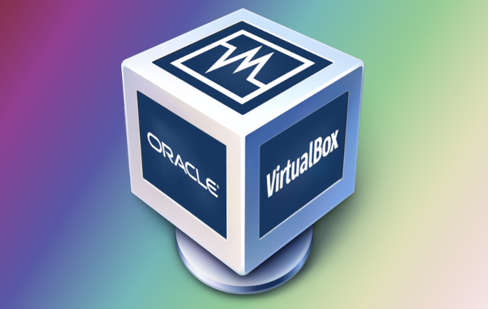

# How to steup a wed server in vitualbox and Ubuntu Server

## Introduction
Setting up a web server on vitualBox using Ubuntu server is a great way to practice web hosting and server management without affecting your main computer.  

## Basic terminology that the reader must know 

### Virtualbox
 
A virtual machine is a software based computer that inside another computer. it allows ypu to create a separate environment for testing or running different operating systems, like Ubuntu Server. 

### Ubuntu Server
 
A lightweight, command-line-based version of the Ubuntu operating system optimized for server use. Unlike Ubuntu Desktop, it doesn't come witha graphical interface. 

### Apache
 
An open source web server software used to host website and serve content to users over the internet.

### SSH
 
SSH stands for Secure Shell. It is a protocol that allows you to connect securely to a remote server or computer over network. 

### Firewall
 
A firewall is a security system that controals incoming and outging network traffic to protect your server from unauthorized access. 

## step-by-step instructions
### part 1 virtual machine 
Here simply include a screenshot of your virtual machine setting and list the Ubuntu Server minimun requirements per [documentation](https://ubuntu.com/server/docs/basic-installation)

### Part 2 Install Ubuntu Server
[tutorial](https://cis106.com/guides/install-ubuntu-server-20.04/)

### Part 3 Install Apache
 [tutorial](https://ubuntu.com/tutorials/install-and-configure-apache#2-installing-apache)

### Part 4 Setup SSH
[tutorial](https://cis106.com/guides/SetupSSHUbuntuServer/)

### Part 5 Setup virtual hosts
[tutorial](https://www.digitalocean.com/community/tutorials/how-to-set-up-apache-virtual-hosts-on-ubuntu-20-04)