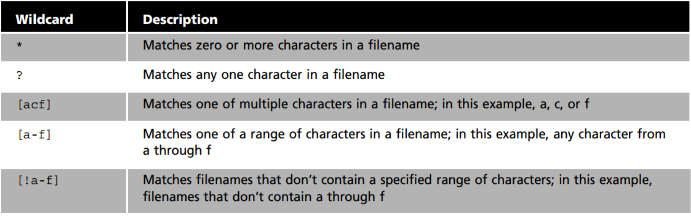

# Note 6

## * Wildcard
* A star alone matches anything and nothing and matches any number of charecters.

### Example:
* list all filles with a particular file extension
  * `ls *.txt`
* move all the .sh (shell scripts) files 
   * `mv wildcard_extra_practice/*.sh wildcard_extra_practice/scripts/`
* list and then move all the image files in the wildcard_extra_practice directory. You will need to create a directory first. 
  * `ls wildcard_extra_practice/img-*.*

## ? wildcard
* The ? wildcard metacharacter matches precisely one character.

### Example:
* List all the files that contain a 4 letter file extension. 
  * `ls -1X wildcard_extra_practice/*.????`
* List all th files Microsoft Office 365 files. 
  * `ls -1X wildcard_extra_practice/*.???x`
* List all th files Microsoft Office 365 files. 
   * `ls -1X wildcard_extra_practice/*.???x`

## [] wildcard
* The brackets wildcard match a single character in a range.

### Example:
* List all the files that start with a capital letter 
  * `ls wildcard_extra_practice/[A-Z]*`
* List all the files that contain a number in their name
  * ``ls wildcard_extra_practice/[0-9]`
* List files with alphabetic characters
  * `ls *[[A-Za-z]]*`
## Brace {} Expansion
* Brace expansion is not a wildcard but another feature of bash that allows you to generate arbitrary strings to use with commands.

### Example:
* To create a whole directory structure in a single command:
  * `mkdir -p music/{jazz,rock}/new{1..3}`
* To create a N number of file use:
  * `touch website{1..5}html`
* Remove multiple file in a single directory
  * `rm -r {dir1,file.txt,file,py}`